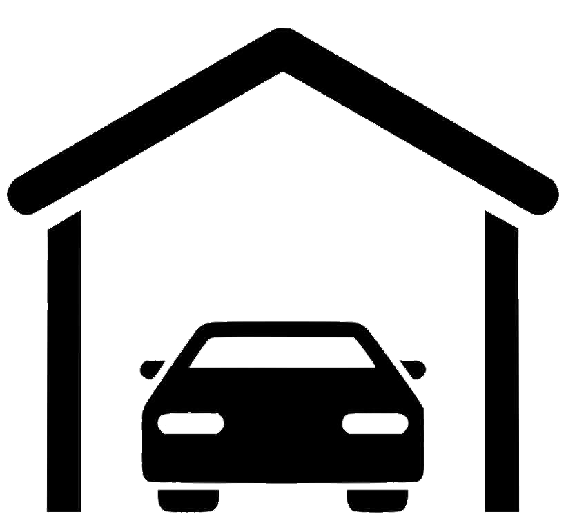

 AMPD helps you find parking and EV charging for any time of vehicle in any parking space anywhere in you city!
 Make some money by becoming a host and help others to find parking and charge their vehicles.

### DEMO Link

 Deployed on Heroku

### About the app

- To access apps functionality, please register using your credentials.
- SignIn available with existing users:

`Email:`

`PW: chicken`


### Code we proud of / Main challenges

```
      <div className='card'>
        
        <div className="card_info">
          <h2>{title}</h2>
          <h4>{description}</h4>
        </div>
```


### Pages

add screenshots of home page and lease a space



### Project on GitHub
Download or clone the repository:

`https://github.com/tracey-web/ampd_server`

`https://github.com/tracey-web/ampd_client`


### Technologies used
Front-End: React JS, CSS\
Back-End: Ruby, API

### List of contributors:
@tracey-web\
@angepol\
@Just-Kundai\
@appaluza


### Special Thanks to
Rowena\
Pat
